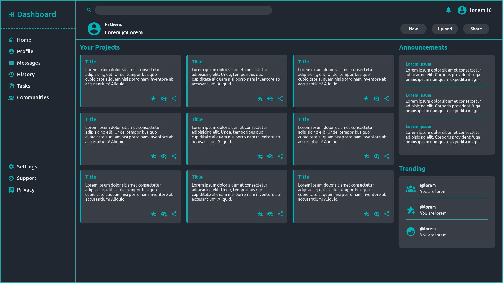

# [Dashboard](https://www.theodinproject.com/paths/full-stack-ruby-on-rails/courses/intermediate-html-and-css/lessons/admin-dashboard)

This project is part of [The Odin Project](https://theodinproject.com)'s full stack web development curriculum

  
Table Of Contents

  <ol>
    <li>
      <a href="#description">Description</a>
    </li>
    <li>
      <a href="#demo">Demo</a>
    </li>
    <li>
      <a href="#built-with">Built With</a>
    </li>
     <li>
      <a href="#what-i-learned">What I Learned</a>
    </li>
     <li>
      <a href="#acknowledgements">Acknowledgements</a>
    </li>
  </ol>

## Description
A Simple Dashboard design built with HTML & CSS with,
* Grid
* Flexbox
* And more of CSS's features

## Demo
Live: [Here](https://top-dashboard.netlify.app/)

  
## Built With
* HTML
* CSS

## What I Learned
* Practical experience with CSS Grid
* Grid `auto-fill` and `auto-fit`
* Grid `minmax`
* Grid item as a `flex` container
* `Grid` and `Flex` practical usage exposure
* CSS organization
* Building one step at a time
  
## Acknowledgements
* Icons from [Material Design Icons](https://materialdesignicons.com/)
* Color palette from [Color Hunt](https://colorhunt.co/palette/222831393e4600adb5eeeeee)
* [The Odin Project](https://theodinproject.com)
* [Netlify](https://netlify.com)

[Move To Top](#dashboard)
